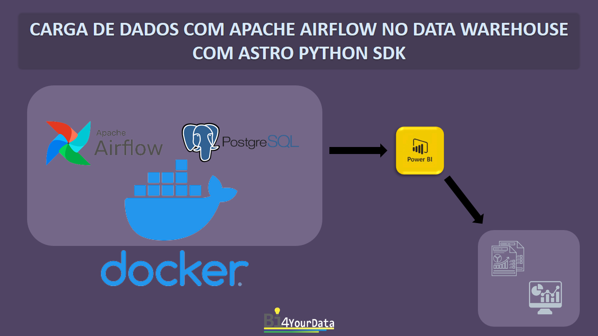
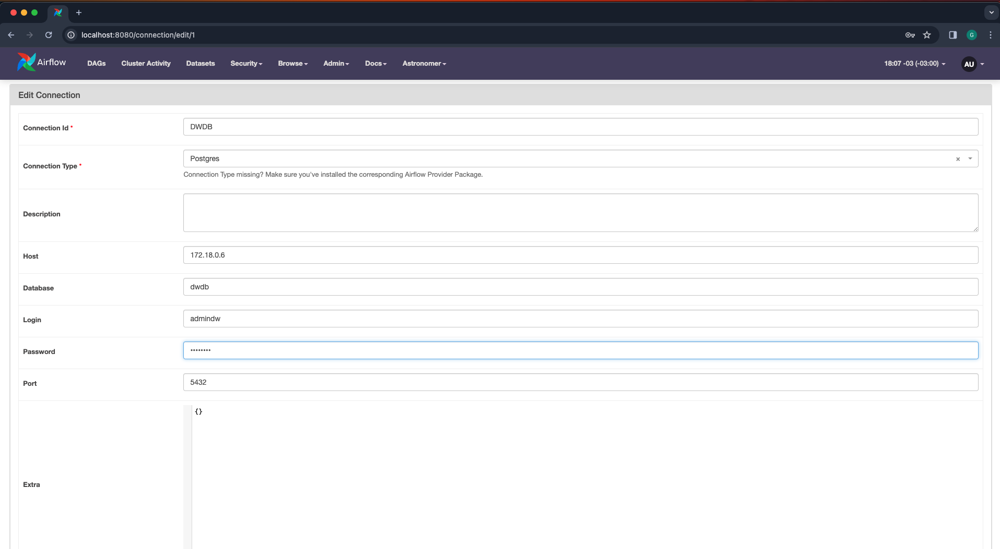
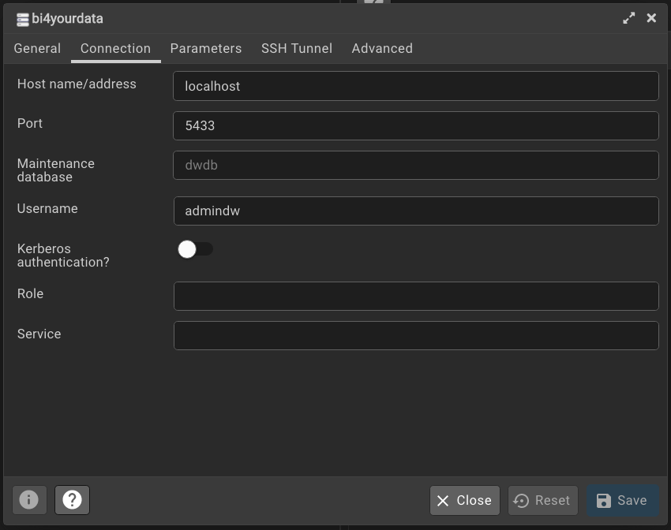
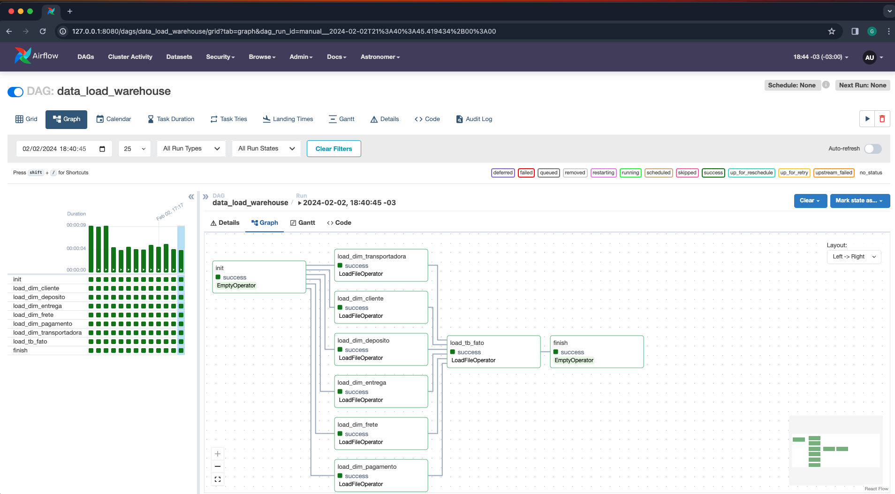

# Carga de Dados com Apache Airflow no Data Warehouse com Astro Python SDK



## Sobre o Projeto

Nesse projeto usaremos o Apache Airflow para orquestrar a carga de dados no Data Warehouse com Astro Python SDK.

### Pré-requisitos para rodar o projeto

* **Astro CLI**: Permite iniciar o Apache Airflow rapidamente. Instruções de instalação para Windows, Mac e Linux você encontra neste [link](https://github.com/astronomer/astro-cli) 

* **Docker**: Instruções de instalação você encontra neste [link](https://www.docker.com/products/docker-desktop/)

* **Astro Python SDK**: Instruções de instalação você encontra neste [link](https://github.com/astronomer/astro-sdk). (É necessário que você tenha instalado alguma versão do python em sua máquina).  

* **VSCode**: Editor de código. Instruções de instalação do VSCode você encontra neste [ link](https://code.visualstudio.com/download).

* **pgAdmin4**: Client do PostgreSQL. Instruções de instalação do pgAdmin 4 você encontra [link](https://www.pgadmin.org/download/)


### Instalação e Configuração

1. Clone o repositório:

```bash
git clone https://github.com/gustavobi4yourdata/Data-Engineering-Project-03.git
cd Data-Engineering-Project-03
```

2. Instale Apache Airflow em docker:

```bash
astro dev start
```

3. Liste as redes docker:

```bash
docker network ls
```

4. Copie o `id` da rede docker do Apache Airflow

5. Suba o banco de dados `PostgreSQL` substituindo o `id` em `id_rede_airflow`:

```bash
docker run --network <id_rede_airflow> --name postgres-bi4yourdata -p 5433:5432 -e POSTGRES_USER=admindw -e POSTGRES_PASSWORD=admindw123 -e POSTGRES_DB=dwdb -d postgres:12.6
```

6. Inspecione a rede de todos os containers e verifique se o container `postgres-bi4yourdata` esta dentro da rede docker do Apache Airflow:

```bash
docker ps --format '{{ .ID }} {{ .Names  }} {{ json .Networks }}'
```

7. **Segunda forma** de verificar se o container `postgres-bi4yourdata` esta na rede docker do Apache Airflow:

```bash
docker network inspect <id_rede_airflow>
```

8. Copie o `ip` do `passo 7` e crie a conexão no UI do Apache Airflow:

    **OBS**: O `ip` da sua rede docker é diferente do meu.  



9. Crie a conexão `no pgAdmin 4`:

    **OBS**: Certifique de que é o mesmo dados que inseriu no `passo 5` 




10. Crie um schema chamado `dw`


## Para rodar a carga de dados no Apache Airflow

1. Habilite o `toggle` da dag `data_load_warehouse`

2. Clique na dag `data_load_warehouse` e em seguida `Graph`

3. Rode o carga de dados em `Trigger DAG`

4. Aguarde a carga de dados rodar e analise os logs

### Use Interface do Apache Airflow



## Links Úteis

1. **Documentação Astronomer Registry**:  [Link](https://registry.astronomer.io/)

2.  **Documentação astro python sdk**:  [Link](https://astro-sdk-python.readthedocs.io/en/stable/index.html#)


## Contato

Para dúvidas, sugestões ou feedbacks:

* **Gustavo Souza** - [gustavo.souza@bi4yourdata.com](mailto:gustavo.souza@bi4yourdata.com)